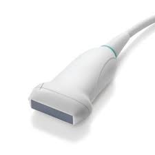
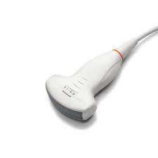
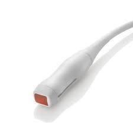

# Emission, propagation et réception des ultrasons

## Qu'est-ce qu'un ultrason?

Un ultrason est une onde mécanique correspondant à la propagation d'une pression dans un milieu. De proche en proche, les molécules du tissu compriment et dépriment les molécules voisines.

Une onde mécanique est caractérisée par:

* Sa fréquence, notée en Hertz (Hz). Un hertz correspond à une oscillation par seconde. Les ultrasons sont, par définition, des ondes mécaniques de fréquence comprise entre 20 kHz et quelques GHz. En pratique médicale, on utilise des fréquences de 2 à 15 MHz.
* Son amplitude, qui correspond à la valeur du pic de pression.


Plus un ultrason a une fréquence élevée, plus son énergie est importante, et plus il sera rapidement atténué dans les tissus : les hautes fréquences sont utiles pour les explorations superficielles, tandis que les basses fréquences sont utiles aux explorations profondes.


## Comment les ultrasons sont-ils émis?

La sonde émet l'ultrason au travers de cellules piézo-électriques. Un élément piézo-électrique est capable de convertir un signal électrique en pression, et inversement. Les cellules piézo-électriques sont ainsi à la fois émettrices et réceptrices.

Les ultrasons sont émis de manière pulsée, pendant un temps restreint, puis la sonde "écoute", c'est-à-dire qu'elle attend la réception des échos avant d'émettre à nouveau. Par ailleurs, une petite partie seulement des cellules émet à chaque impulsion, puis la portion suivante, et ainsi de suite. Ceci permet à la sonde de réaliser un balayage le long de la rangée de cellules.

## Types de sondes et orientation des ultrasons

L'orientation des ultrasons dépend:

* De la forme de la sonde, linéaire ou curvilinéaire
* Du décalage de phase des ultrasons : il est possible de décaler légèrement l'émission des ultrasons lors d'une impulsion, pour "orienter" l'envoi d'ultrasons. Ainsi, même lorsque la ligne de cellules piézo-électriques est linéaire, il est possible d'explorer un large champ. C'est le principe du "phased array"

Ainsi, la forme de la sonde et l'utilisation du décalage de phase permettent de déterminer dans quelles situation une sonde peut être utilisée :

* linéaire : balayage en surface
* curvilinéaire : éventail à base large, permettant de balayer une zone large et profonde
* phased array : éventail à base étroite, permettant de balayer une zone large et profonde, à partir d'une surface d'entrée restreinte


Il existe trois types de sondes utilisées en médecine d'urgence : linéaire, curvilinéaire, phased array


|                     Sonde                    |                Linéaire                |                Curvilinéaire                |              Phased array              |
| :------------------------------------------: | :------------------------------------: | :-----------------------------------------: | :------------------------------------: |
|                                              |  |  |  |
|                   Fréquence                  |               7.5-11 MHz               |                   2-5 MHz                   |                2-10 MHz                |
|                    Abdomen                   |                    -                   |                      ++                     |                    +                   |
|                Voies urinaires               |                    -                   |                      ++                     |                    +                   |
|                    Poumons                   |                ++ (Apex)               |                  + (Bases)                  |      
++ (Bases) + (Apex)
     |
|                     Coeur                    |                    -                   |       + (pour la coupe sous-xyphoïïde)      |                   ++                   |
|                     Crâne                    |                    -                   |                      -                      |                   ++                   |
|                Sein, thyroïde                |                   ++                   |                      -                      |                    -                   |
| Os, muscles, vaisseaux des membres et du cou |                   ++                   |                      -                      |                    -                   |

\[++ : sonde recommandée / + : usage possible / - : usage inadapté]

## Propagation, transmission, réflexion

Les ondes ultrasoniques se propagent dans les milieux biologiques de proche en proche. Tout milieu biologique a une capacité plus ou moins grande à transmettre les ultrasons : on parle d'impédance acoustique. Un milieu avec une forte impédance acoustique transmettra plus facilement les ultrasons. Le long de ce trajet, une petite partie de l'énergie des ultrasons est diffusée au milieu, sous forme de chaleur

Lorsque les ultrasons traversent un changement de milieu, on parle d'interface. Il se produit alors à la fois un phénomène de transmission et de réflexion:

* Une partie des ultrasons va être réfléchie, et retourner et être capté par la sonde
* Une autre partie va être transmise au nouveau milieu et continuer son parcours


L'énergie des ultrasons se répartit en trois composantes : transmission, réflexion, diffusion.


La proportion entre transmission et réflexion dépend de la différence d'impédance entre les deux milieux : plus la différence est importante, plus la réflexion sera importante. A titre d'illustration, le tableau suivant présente l'impédance et le coefficient de transmission entre deux milieux.

|     Milieu (impédance)    |  Air  | Eau, tissus mous |  Rein  | Graisse périrénale |   Os   |
| :-----------------------: | :---: | :--------------: | :----: | :----------------: | :----: |
|         Air (0.4)         |  100% |       0.05%      |  0.05% |        0.06%       |  0.02% |
|  Eau, tissus mous (1500)  | 0.05% |       100%       | 95.15% |       95.83%       | 46.15% |
|        Rein (1620)        | 0.05% |      95.15%      |  100%  |         92%        | 48.94% |
| Graisse périrénale (1380) | 0.06% |      95.83%      |   92%  |        100%        | 43.26% |
|         Os (5000)         | 0.02% |      46.15%      | 48.94% |       43.26%       |  100%  |

On peut noter que les coefficients de transmission sont importants entre l'eau, la graisse, le parenchyme rénal, entraînant peu de perte d'énergie. A l'inverse, l'os entraîne une réflexion de 40 à 50% des ultrasons. Enfin, l'air entraîne une réflexion de la quasi-totalité des ultrasons: c'est un "miroir" à ultrasons.


L'air est un "miroir" à ultrasons


##
