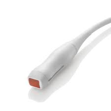

# Emission, propagation and reception of ultrasound

## What is an ultrasound?

An ultrasound is a mechanical wave corresponding to the propagation of a pressure in a substance. The molecules in the tissue compress and depress the neighbouring molecules from close to close.

A mechanical wave is characterised by:

* Its frequency, noted in Hertz (Hz). One hertz corresponds to one oscillation per second. Ultrasound is, by definition, a mechanical wave with a frequency between 20 kHz and a few GHz. In medical practice, frequencies of 2 to 15 MHz are used.
* Its amplitude, which corresponds to the value of the pressure peak.


The higher the frequency of an ultrasound, the greater its energy, and the faster it will be attenuated in the tissue: high frequencies are useful for superficial investigations, while low frequencies are helpful for deep investigations.


## How is ultrasound emitted?

The probe emits ultrasound through piezoelectric cells. A piezoelectric element is capable of converting an electrical signal into pressure and conversely. The piezoelectric cells are thus both emitters and receivers.

Ultrasound is emitted in a pulsed manner for a short time and then the probe "listens", i.e. it waits for the echoes to be received before emitting again. In addition, only a small portion of the cells emit at each pulse, then the next portion, and so on. This allows the probe to scan along the row of cells.

## Probe types and ultrasound orientation

The orientation of the ultrasound depends:

* The shape of the probe, linear or curvilinear
* The phase shift of the ultrasound: it is possible to slightly shift the ultrasound emission during a pulse, to "orient" the ultrasound emitted. Thus, even when the row of piezoelectric cells is linear, it is possible to explore a large field. This is the principle of the "phased array".

Thus, the shape of the probe and the use of phased array determine in which situations a probe can be used:

* linear: surface scan
* curvilinear: a fan with a wide base, allowing a wide and deep area to be scanned
* phased array: a fan with a narrow base, allowing a wide and deep area to be scanned from a small entrance area


There are three types of probes used in emergency medicine: linear, curvilinear, phased array


|                  Probe                 |                 Linear                 |                 Curvilinear                 |              Phased array              |
| :------------------------------------: | :------------------------------------: | :-----------------------------------------: | :------------------------------------: |
|                                        |  |  |  |
|                Frequency               |               7.5-11 MHz               |                   2-5 MHz                   |                2-10 MHz                |
|                 Abdomen                |                    -                   |                      ++                     |                    +                   |
|              Urinary tract             |                    -                   |                      ++                     |                    +                   |
|                  Lungs                 |                ++ (Apex)               |                  + (Bases)                  |      
++ (Bases) + (Apex)
     |
|                  Heart                 |                    -                   |           + (for subxyphoid view)           |                   ++                   |
|                  Skull                 |                    -                   |                      -                      |                   ++                   |
|             Breast, thyroïd            |                   ++                   |                      -                      |                    -                   |
| Bones, muscles, limbs and neck vessels |                   ++                   |                      -                      |                    -                   |

\[++ : recommended probe / + : possible use / - : inappropriated use]

## Propagation, transmission, reflection

Ultrasound waves propagate in biological tissues from near to far. Every biological structure has a greater or lesser capacity to transmit ultrasound: this is called acoustic impedance. A substance with a high acoustic impedance will transmit ultrasound more easily. Along this path, a small part of the ultrasound energy is diffused to the environment as heat.

When ultrasound passes through a change of medium, it is called an interface. Both transmission and reflection occur:

* Part of the ultrasound will be reflected, and return and be received by the probe
* Another part will be transmitted to the new environment and continue its path


Ultrasound energy is divided into three components: transmission, reflection and diffusion.


The proportion between transmission and reflection depends on the difference in impedance between the two media: the greater the difference, the greater the reflection. The following table shows the impedance and the transmission coefficient between two media:

|     Medium (impedance)    |  Air  | Water, soft tissue | Kidney | Perirenal fat |  Bone  |
| :-----------------------: | :---: | :----------------: | :----: | :-----------: | :----: |
|         Air (0.4)         |  100% |        0.05%       |  0.05% |     0.06%     |  0.02% |
| Water, soft tissue (1500) | 0.05% |        100%        | 95.15% |     95.83%    | 46.15% |
|       Kidney (1620)       | 0.05% |       95.15%       |  100%  |      92%      | 48.94% |
|    Perirenal fat (1380)   | 0.06% |       95.83%       |   92%  |      100%     | 43.26% |
|        Bone (5000)        | 0.02% |       46.15%       | 48.94% |     43.26%    |  100%  |

It can be noted that the transmission coefficients are high between water, fat and renal parenchyma, resulting in little reflection. On the other hand, bone causes a reflection of 40 to 50% of the ultrasound. Finally, air reflects almost all the ultrasound: it is an ultrasound "mirror".


Air is an ultrasound "mirror" !


##
